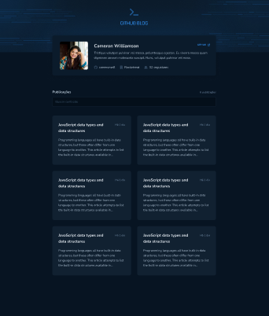
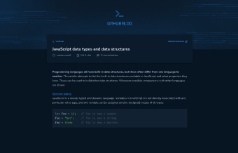

<h1 align="center">


</h1>


<p align="center">
  Github Blog  📰🚀
  <br>
  <br>


</p>

---

<p align="center">
  <a href="#dart-sobre">Sobre</a> &#xa0; | &#xa0; 
  <a href="#rocket-tecnologias">Tecnologias</a> &#xa0; | &#xa0;
  <a href="#white_check_mark-requerimentos">Requerimentos</a> &#xa0; | &#xa0;
  <a href="#checkered_flag-começando">Começando</a> &#xa0; &#xa0; 
 
</p>

<br>


## :dart: Sobre ##


O Projeto Github Blog tem como objetivo consumir a API do GitHub para listar as issues cadastradas, informações do usuário e exibir cada issue em rotas por parâmetro.

O GitHub é uma plataforma que hospeda repositórios de códigos fonte, permitindo que programadores possam colaborar entre si em projetos de software. As issues são um recurso do GitHub que permitem o acompanhamento e gerenciamento de problemas em projetos.

Com o Projeto Github Blog, é possível obter informações detalhadas sobre as issues de um repositório específico, como o título, descrição, data de criação, autor e estado atual. Além disso, também é possível listar as informações do usuário que está acessando a API, como nome, e-mail e foto de perfil.

A lista de issues é exibida em rotas por parâmetro, o que permite uma navegação mais fácil e rápida pelos problemas identificados no projeto. Com essa funcionalidade, é possível realizar a filtragem das issues de acordo com o estado atual (aberta, fechada, em andamento), bem como a ordenação por data de criação ou prioridade.

O Projeto Github Blog é uma ferramenta valiosa para desenvolvedores que utilizam o GitHub como plataforma de colaboração em projetos de software, pois permite uma visão rápida e precisa dos problemas identificados e a possibilidade de acompanhamento em tempo real das atividades relacionadas às issues.

Regras:

- Listagem de produtos (cafés) disponíveis para compra
- Adicionar uma quantidade específicas de itens no carrinho
- Aumentar ou remover a quantidade de itens no carrinho
- Formulário para o usuário preencher o seu endereço
- Exibir o total de itens no carrinho no Header
- Exibir o valor total da soma de itens no carrinho multiplicados pelo valor.

<br>


## 🧪 Tecnologias ##

As seguintes tecnologias foram utilizadas no projeto:

- [React](https://react.org/)
- [Styled-componets](https://styled-components.com/)
- [typescript](https://www.typescriptlang.org/)
- [axios](https://axios-http.com/ptbr/docs/intro)
- [react-hook-form](https://react-hook-form.com/)
- [useParams](https://reactrouter.com/en/main/hooks/use-params)

## :checkered_flag: Começando ##

```bash
# Clone this project
$ git clone https://github.com/thiagofreitascarneiro/github-blog
# Access
$ cd github-blog
# Install dependencies
$ npm install
# Run the project
$ npm run dev
# The server will initialize in the <http://localhost:5173>
```
## :framed_picture: Figma ##

- [Figma](https://www.figma.com/file/7iyYAOK2Tv8SbA0WBz3f8B/GitHub-Blog-(Community)?type=design&node-id=0-1&t=SIBk1t7MEsXqwnLv-0)


</br>

